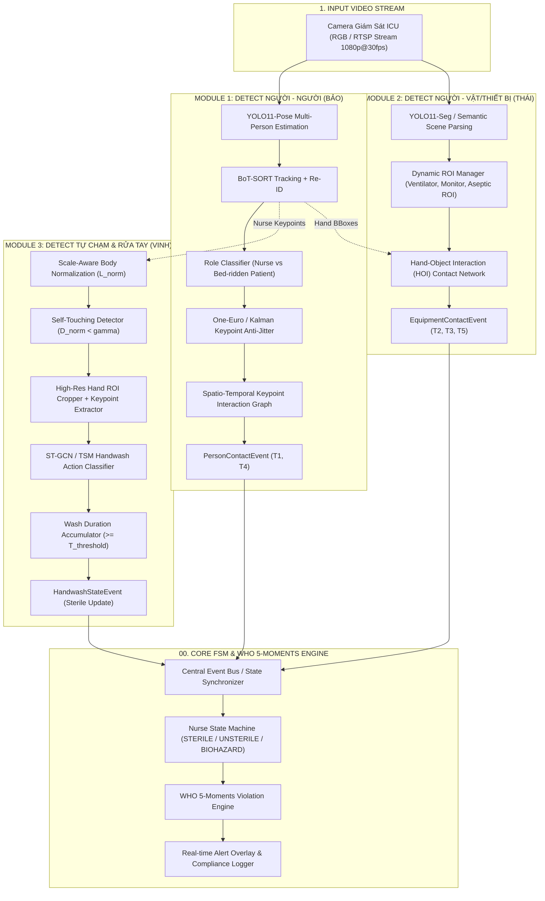
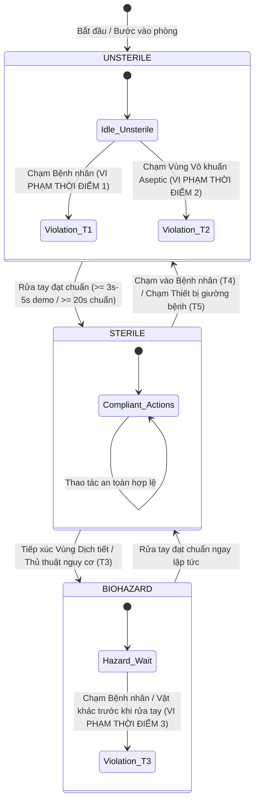

# HỆ THỐNG GIÁM SÁT TỰ ĐỘNG TUÂN THỦ 5 THỜI ĐIỂM VỆ SINH TAY WHO TRONG ICU
> **AI-Based Computer Vision System for WHO 5 Moments Hand Hygiene Compliance in Intensive Care Units (ICU)**

---

## 📑 MỤC LỤC
1. [Giới Thiệu & Bối Cảnh Dự Án](#1-giới-thiệu--bối-cảnh-dự-án)
2. [Cơ Sở Lâm Sàng: Chuẩn Hóa 5 Thời Điểm Vàng WHO](#2-cơ-sở-lâm-sàng-chuẩn-hóa-5-thời-điểm-vàng-who)
3. [Đánh Giá Bản Demo Hiện Tại & Chiến Lược Cải Tiến](#3-đánh-giá-bản-demo-hiện-tại--chiến-lược-cải-tiến)
4. [Kiến Trúc Hệ Thống Tổng Thể (End-to-End Architecture)](#4-kiến-trúc-hệ-thống-tổng-thể-end-to-end-architecture)
5. [Bộ Quản Lý Trạng Thái Vô Trùng (Finite State Machine - FSM)](#5-bộ-quản-lý-trạng-thái-vô-trùng-finite-state-machine---fsm)
6. [Cấu Trúc Dự Án & Phân Công 3 Nhánh Nghiên Cứu](#6-cấu-trúc-dự-án--phân-công-3-nhánh-nghiên-cứu)
7. [Chuẩn Hóa Giao Tiếp Dữ Liệu (Inter-Module Data Contract)](#7-chuẩn-hóa-giao-tiếp-dữ-liệu-inter-module-data-contract)
8. [Kế Hoạch Triển Khai & Chỉ Số Đánh Giá (Evaluation Metrics)](#8-kế-hoạch-triển-khai--chỉ-số-đánh-giá-evaluation-metrics)

---

## 1. GIỚI THIỆU & BỐI CẢNH DỰ ÁN

Nhiễm khuẩn bệnh viện (Hospital-Acquired Infections - HAIs), đặc biệt tại khoa Hồi sức tích cực (ICU), là một trong những nguyên nhân hàng đầu gây tăng tỷ lệ tử vong, kéo dài thời gian nằm viện và làm phát sinh chi phí y tế khổng lồ. Bàn tay của nhân viên y tế (bác sĩ, điều dưỡng) là vector truyền bệnh trung gian phổ biến nhất.

Hệ thống **Handwash-Master** được thiết kế nhằm mục tiêu:
- Tự động hóa hoàn toàn quy trình giám sát tuân thủ vệ sinh tay dựa trên luồng video camera giám sát phòng ICU 24/7.
- Không can thiệp vào quy trình thao tác lâm sàng của nhân viên y tế (Non-intrusive / Contactless).
- Đánh giá chính xác theo **5 Thời Điểm Vàng Rửa Tay** do Tổ chức Y tế Thế giới (WHO) ban hành.
- Cung cấp cơ chế cảnh báo theo thời gian thực và xuất báo cáo tỷ lệ tuân thủ (Compliance Rate) minh bạch.

```
                    ┌──────────────────────────────────────────────────┐
                    │               CAMERA GIÁM SÁT ICU                │
                    └─────────────────────────┬────────────────────────┘
                                              │ (Video Stream 30 FPS)
                                              ▼
                    ┌──────────────────────────────────────────────────┐
                    │            HỆ THỐNG AI VISION MULTI-TASK         │
                    │  - Module 1: Detect Người - Người (Bảo)          │
                    │  - Module 2: Detect Người - Vật/Thiết bị (Thái)  │
                    │  - Module 3: Detect Tự chạm & Rửa tay (Vinh)    │
                    └─────────────────────────┬────────────────────────┘
                                              │ (Event Stream)
                                              ▼
                    ┌──────────────────────────────────────────────────┐
                    │       CORE FSM & WHO 5-MOMENTS ENGINE            │
                    │  - Quản lý trạng thái: Sterile / Unsterile       │
                    │  - Bắt lỗi vi phạm theo 5 thời điểm WHO          │
                    │  - Dashboard & Cảnh báo thời gian thực          │
                    └──────────────────────────────────────────────────┘
```

---

## 2. CƠ SỞ LÂM SÀNG: CHUẨN HÓA 5 THỜI ĐIỂM VÀNG WHO

Theo chuẩn WHO (*5 Moments for Hand Hygiene*), không gian chăm sóc y tế ICU được phân định thành 2 vùng không gian vật lý:
1. **Vùng bệnh nhân (Patient Zone):** Bệnh nhân cùng toàn bộ vật dụng, bề mặt dành riêng cho bệnh nhân (giường bệnh, ga trải, thanh chắn, monitor gắn giường, đường truyền đang kết nối vào người).
2. **Vùng chăm sóc y tế (Health-care Area):** Tất cả các bề mặt, thiết bị dùng chung bên ngoài vùng bệnh nhân (xe tiêm, bàn thao tác, máy thở dùng chung, cửa ra vào, bàn làm việc điều dưỡng).

```
   ┌───────────────────────────────────────────────────────────────────┐
   │ Health-care Area (Vùng chăm sóc y tế)                             │
   │   ┌────────────────────────────────────────────────────────────┐  │
   │   │ Patient Zone (Vùng bệnh nhân)                              │  │
   │   │  [Thiết bị/Vật dụng giường bệnh]                          │  │
   │   │       │                                                    │  │
   │   │  (5) Sau tiếp xúc vật dụng                                │  │
   │   │       │                                                    │  │
   │   │  (1) Trước khi chạm ──► [BỆNH NHÂN] ──► (4) Sau khi chạm   │  │
   │   │                              ▲                             │  │
   │   │               (2) Trước thủ  │  (3) Sau tiếp xúc           │  │
   │   │               thuật vô khuẩn │  nguy cơ dịch               │  │
   │   │                              │                             │  │
   │   │                    [Vùng thủ thuật / Dịch tiết]           │  │
   │   └────────────────────────────────────────────────────────────┘  │
   │                                                                   │
   │  [Vị trí bình rửa tay / Cồn sát khuẩn]                           │
   └───────────────────────────────────────────────────────────────────┘
```

### Ma Trận Logic Kích Hoạt 5 Thời Điểm Chuẩn WHO:

| STT | Tên thời điểm theo WHO | Định nghĩa lâm sàng | Vùng & Sự kiện kích hoạt (Trigger Event) | Logic Trạng thái Yêu cầu (State Requirement) | Vi phạm xảy ra khi |
| :--- | :--- | :--- | :--- | :--- | :--- |
| **1** | **Trước khi chạm bệnh nhân** (*Before touching a patient*) | Trước khi tiếp xúc cơ thể hoặc quần áo bệnh nhân khi bước vào Patient Zone. | Nhân viên y tế di chuyển từ Health-care Area vào Patient Zone và phát hiện tiếp xúc giữa tay nhân viên và cơ thể bệnh nhân. | Trạng thái tay nhân viên phải là `STERILE` (đã rửa tay trước đó và chưa chạm bề mặt ô nhiễm). | Tay đang ở trạng thái `UNSTERILE` hoặc `BIOHAZARD` mà chạm vào bệnh nhân $\rightarrow$ **Vi phạm T1**. |
| **2** | **Trước quy trình sạch / vô trùng** (*Before clean/aseptic procedure*) | Trước khi thao tác tại vùng có nguy cơ nhiễm khuẩn cao (đặt catheter, hút đờm nội khí quản, tiêm truyền, thay băng). | Bàn tay nhân viên y tế tiến vào và tiếp xúc với **Aseptic ROI** (vùng vô khuẩn, ống thở, catheter, khay vô khuẩn). | Trạng thái tay bắt buộc phải là `STERILE` ngay trước khi chạm vào Aseptic ROI. | Vừa chạm vào giường/thiết bị khác mà chưa sát khuẩn lại trước khi làm thủ thuật $\rightarrow$ **Vi phạm T2**. |
| **3** | **Sau khi tiếp xúc nguy cơ dịch cơ thể** (*After body fluid exposure risk*) | Ngay sau khi hoàn thành thao tác có nguy cơ dính dịch tiết sinh học (hút đờm, thay băng vết thương, tháo ống dẫn lưu). | Kết thúc thao tác tại vùng nguy cơ dịch tiết, tay nhân viên rời khỏi vị trí nguy cơ. | Trạng thái tay lập tức bị giáng xuống `BIOHAZARD`. Bắt buộc phải rửa tay ngay lập tức trước khi chạm bất kỳ vật gì khác. | Chạm vào bệnh nhân hoặc vật dụng khác sau khi dính dịch tiết mà chưa rửa tay $\rightarrow$ **Vi phạm T3**. |
| **4** | **Sau khi chạm bệnh nhân** (*After touching a patient*) | Sau khi kết thúc khám, chăm sóc, tiếp xúc cơ thể bệnh nhân và chuẩn bị rời đi. | Tay nhân viên y tế rời khỏi cơ thể bệnh nhân và di chuyển ra khỏi Patient Zone hoặc chuyển sang tác vụ khác. | Trạng thái tay chuyển thành `UNSTERILE`. Bắt buộc phải rửa tay trước khi tiếp xúc bệnh nhân khác hoặc môi trường chung. | Rời khỏi bệnh nhân mà tiếp xúc bệnh nhân khác hoặc ra khu vực chung mà không rửa tay $\rightarrow$ **Vi phạm T4**. |
| **5** | **Sau khi chạm vật dụng xung quanh** (*After touching patient surroundings*) | Sau khi chạm vào bất kỳ thiết bị, bề mặt trong Patient Zone (máy thở, monitor, thanh giường) dù không chạm người bệnh. | Phát hiện tiếp xúc giữa tay nhân viên và các thiết bị/đồ vật trong Patient Zone, sau đó rời khỏi vùng. | Trạng thái tay chuyển thành `UNSTERILE`. Bắt buộc phải rửa tay trước khi rời khỏi khu vực hoặc chạm vào vùng sạch. | Chạm vào thiết bị giường bệnh rồi bước sang bệnh nhân khác/vùng sạch mà không rửa tay $\rightarrow$ **Vi phạm T5**. |

---

## 3. ĐÁNH GIÁ BẢN DEMO HIỆN TẠI & CHIẾN LƯỢC CẢI TIẾN

### Phân Tích Các Hạn Chế Của Bản Demo Cũ:
1. **Khoảng cách pixel cố định (Fixed Pixel Distance):** Bản demo cũ dùng ngưỡng khoảng cách Euclidean dạng pixel cố định giữa 2 cổ tay ($D_{px} < \text{threshold}$). Cách này sai lệch nghiêm trọng khi nhân viên y tế đứng gần camera (tay to, khoảng cách pixel lớn) so với khi đứng xa (tay nhỏ, khoảng cách pixel nhỏ).
2. **Mô hình nhận diện rửa tay CNN 2D tĩnh:** Phân loại chuỗi ảnh bằng CNN 2D cắt lát khung hình dễ bị nhầm lẫn bởi màu da, ánh sáng gắt, bóng đổ hoặc các hành vi đan tay, nắm tay thông thường.
3. **Chưa phân đoạn thiết bị và vùng vô khuẩn:** Demo cũ chỉ có 2 nhãn "Tự chạm tay" và "Chạm bệnh nhân", hoàn toàn bỏ sót các tương tác với thiết bị y tế (máy thở, bơm tiêm điện, khay vô khuẩn, dẫn lưu) $\rightarrow$ **Không thể giám sát được Thời điểm 2, 3 và 5**.
4. **Theo dõi đối tượng (Tracking) đơn giản:** Thiếu trích xuất đặc trưng Re-ID, dễ bị đổi ID (ID switch) khi nhân viên y tế bị che khuất (occlusion) bởi rèm, máy thở hoặc đồng nghiệp.

### Chiến Lược Cải Tiến Hệ Thống (Toàn Bộ Pipeline):
- **Chuẩn hóa Scale-Aware Normalization:** Chuẩn hóa khoảng cách 2 tay theo tỷ lệ kích thước khung xương cơ thể ($L_{\text{norm}} = \|\mathbf{P}_{\text{Left\_Shoulder}} - \mathbf{P}_{\text{Right\_Shoulder}}\|_2$).
- **Spatial-Temporal Action Recognition:** Nâng cấp lên mạng `ST-GCN` trên 21 keypoints bàn tay hoặc `TSM-MobileNetV3` trên clip chuỗi 16 frames để nhận diện chính xác chuyển động chà xát thực sự.
- **Semantic Scene Segmentation & Dynamic ROI Caching:** Sử dụng `YOLO11-Seg` kết hợp quản lý ROI động nhằm nhận diện chính xác các thiết bị ICU và vùng vô khuẩn mà vẫn tối ưu GPU.
- **Pose Tracking & Spatio-Temporal Interaction Graph:** Dùng `YOLO11-pose` + `BoT-SORT` (với Re-ID feature extraction) kết hợp đồ thị không-thời gian để xác định chính xác tương tác Người - Người và Người - Vật.

---

## 4. KIẾN TRÚC HỆ THỐNG TỔNG THỂ (END-TO-END ARCHITECTURE)



---

## 5. BỘ QUẢN LÝ TRẠNG THÁI VÔ TRÙNG (FINITE STATE MACHINE - FSM)

Mỗi nhân viên y tế khi xuất hiện trong khung hình được gán một thực thể FSM độc lập để theo dõi trạng thái vô trùng của đôi bàn tay:



---

## 6. CẤU TRÚC DỰ ÁN & PHÂN CÔNG 3 NHÁNH NGHIÊN CỨU

Hệ thống mã nguồn được tổ chức thành các module thư mục độc lập với trách nhiệm rõ ràng:

```text
handwash-master/
├── README.md                                    # Tài liệu Master tổng thể toàn bộ dự án
├── GIT_LINK.md                                  # Thông tin cấu hình Git repository & worktree
├── demo.md                                      # Tài liệu tóm tắt thuật toán & luồng demo gốc
├── implementation_plan.md                       # Bản kế hoạch tổng thể & phân tích tối ưu
│
├── 00_core_system_fsm/                          # MODULE TỔNG HỢP: FSM & WHO 5-MOMENTS ENGINE
│   ├── README.md                                # Đặc tả FSM, kiến trúc tích hợp Data Bus & Rules
│   ├── who_fsm_engine.py                        # Finite State Machine quản lý trạng thái vô trùng
│   └── event_contracts.py                       # Định nghĩa Dataclass & Data Contracts chuẩn
│
├── 01_detect_nguoi_voi_nguoi_Bao/               # MODULE 1: DETECT NGƯỜI VỚI NGƯỜI (Phụ trách: BẢO)
│   ├── README.md                                # Đặc tả kỹ thuật, lý thuyết toán học & Deliverables
│   ├── pose_tracking.py                         # YOLO11-Pose + BoT-SORT Tracking
│   ├── person_role_classifier.py                # Phân loại vai trò Y tá (Dynamic) vs Bệnh nhân (Bed)
│   └── person_contact_graph.py                  # Spatio-Temporal Interaction Graph xác định tiếp xúc
│
├── 02_detect_nguoi_voi_vat_Thai/                # MODULE 2: DETECT NGƯỜI VỚI VẬT & THIẾT BỊ (Phụ trách: THÁI)
│   ├── README.md                                # Đặc tả kỹ thuật, phân đoạn ICU & Deliverables
│   ├── scene_segmentation.py                    # YOLO11-Seg / SAM phân đoạn thiết bị & Patient Zone
│   ├── dynamic_roi_manager.py                   # Quản lý & Caching tọa độ ROI máy thở, monitor, khay
│   └── hand_object_contact.py                   # Hand-Object Interaction (HOI) Contact State Network
│
├── 03_detect_tu_cham_tay_va_rua_tay_Vinh/       # MODULE 3: DETECT TỰ CHẠM TAY & RỬA TAY (Phụ trách: VINH)
│   ├── README.md                                # Đặc tả kỹ thuật, Scale Normalization & Deliverables
│   ├── scale_normalizer.py                      # Thuật toán chuẩn hóa khoảng cách theo tỉ lệ cơ thể L_norm
│   ├── self_touch_detector.py                   # Module phát hiện 2 cổ tay tự chạm nhau
│   └── handwash_action_classifier.py            # Mô hình nhận diện hành động rửa tay (ST-GCN / TSM)
│
└── archive/
    └── legacy-research/                         # Nhánh lưu trữ dữ liệu nghiên cứu cũ
```

### Bảng Tổng Hợp Phân Công Nhiệm Vụ 3 Nhánh:

| Nhánh & Folder | Thành viên | Nhiệm vụ trọng tâm | Output Deliverables |
| :--- | :--- | :--- | :--- |
| **01_detect_nguoi_voi_nguoi_Bao** | **Bảo** | - Tracking đa người với `YOLO11-pose` + `BoT-SORT`<br>- Phân loại Y tá vs Bệnh nhân bất động trên giường<br>- Đồ thị tương tác Keypoint không-thời gian (Spatiotemporal Graph)<br>- Phát hiện tiếp xúc Y tá - Bệnh nhân (Thời điểm WHO 1 & 4) | - Code Python module hoàn chỉnh<br>- Precision/Recall tiếp xúc $\ge 90\%$<br>- Tốc độ xử lý $\ge 30$ FPS<br>- Event `PersonContactEvent` |
| **02_detect_nguoi_voi_vat_Thai** | **Thái** | - Phân đoạn ngữ nghĩa thiết bị ICU (`YOLO11-Seg`/`SAM`)<br>- Quản lý Dynamic ROI (`Ventilator`, `Monitor`, `Aseptic ROI`, `Body Fluid Area`, `Sanitizer`)<br>- Hand-Object Contact State Network (Thời điểm WHO 2, 3 & 5)<br>- Tối ưu hóa GPU Caching | - Code Python module hoàn chỉnh<br>- mIoU phân đoạn thiết bị $\ge 80\%$<br>- Độ chính xác phát hiện chạm vật $\ge 88\%$<br>- Event `EquipmentContactEvent` |
| **03_detect_tu_cham_tay_va_rua_tay_Vinh** | **Vinh** | - Thuật toán Scale-Aware Normalization ($L_{\text{norm}}$) giải quyết bài toán sai cự ly xa/gần<br>- Phát hiện Self-touching tự chạm tay<br>- Nhận diện hành động rửa tay chuỗi thời gian (`ST-GCN` / `TSM-MobileNetV3`)<br>- Tích lũy thời lượng rửa tay quy chuẩn | - Code Python module hoàn chỉnh<br>- F1-score Self-touch $\ge 92\%$<br>- Accuracy phân loại rửa tay $\ge 93\%$<br>- Event `HandwashStateEvent` |
| **00_core_system_fsm** | **Toàn đội** | - FSM Engine quản lý chuyển trạng thái `STERILE`, `UNSTERILE`, `BIOHAZARD`<br>- Logic Engine bắt vi phạm 5 thời điểm WHO<br>- Hệ thống Data Event Bus kết nối 3 luồng và xuất Dashboard | - Code Core FSM Engine<br>- Báo cáo tổng hợp & Dashboard Demo |

---

## 7. CHUẨN HÓA GIAO TIẾP DỮ LIỆU (INTER-MODULE DATA CONTRACT)

Tất cả các module giao tiếp thông qua cấu trúc dữ liệu chuẩn được định nghĩa tại `00_core_system_fsm/event_contracts.py`:

```python
from dataclasses import dataclass
from typing import List, Tuple, Optional
from enum import Enum

class HandState(Enum):
    UNSTERILE = "UNSTERILE"
    STERILE = "STERILE"
    BIOHAZARD = "BIOHAZARD"

class WHOMoment(Enum):
    MOMENT_1_BEFORE_PATIENT = "M1_BEFORE_PATIENT"
    MOMENT_2_BEFORE_ASEPTIC = "M2_BEFORE_ASEPTIC"
    MOMENT_3_AFTER_BODY_FLUID = "M3_AFTER_BODY_FLUID"
    MOMENT_4_AFTER_PATIENT = "M4_AFTER_PATIENT"
    MOMENT_5_AFTER_SURROUNDINGS = "M5_AFTER_SURROUNDINGS"

@dataclass
class PersonContactEvent:
    frame_id: int
    timestamp: float
    nurse_id: int
    patient_id: int
    is_touching: bool
    contact_confidence: float
    nurse_wrist_pos: Tuple[float, float]
    patient_body_part: str

@dataclass
class EquipmentContactEvent:
    frame_id: int
    timestamp: float
    nurse_id: int
    equipment_type: str  # 'VENTILATOR', 'MONITOR', 'BED_RAIL', 'ASEPTIC_TRAY', 'CATHETER'
    is_aseptic_zone: bool
    is_body_fluid_risk: bool
    contact_iou: float

@dataclass
class HandwashStateEvent:
    frame_id: int
    timestamp: float
    nurse_id: int
    is_self_touching: bool
    is_washing_action: bool
    wash_duration_sec: float
    is_wash_completed: bool
```

---

## 8. KẾ HOẠCH TRIỂN KHAI & CHỈ SỐ ĐÁNH GIÁ (EVALUATION METRICS)

### Tiêu Chuẩn Kỹ Thuật (KPIs & Metrics):
- **Tốc độ toàn hệ thống (System Throughput):** Đạt $\ge 25 - 30$ FPS trên GPU tiêu chuẩn (NVIDIA RTX 3060 / 4070 hoặc T4/A100).
- **Độ trễ phát hiện vi phạm (Alert Latency):** $\le 0.5$ giây kể từ khi xảy ra hành vi vi phạm.
- **Độ chính xác phân loại tiếp xúc Người - Người (Bảo):** Precision $\ge 90\%$, Recall $\ge 88\%$.
- **Độ chính xác nhận diện tiếp xúc Thiết bị y tế (Thái):** mIoU Segmentation $\ge 80\%$, Contact Accuracy $\ge 88\%$.
- **Độ chính xác nhận diện Rửa tay (Vinh):** Self-touch F1 $\ge 92\%$, Action Accuracy $\ge 93\%$.
- **Độ chính xác đối chiếu 5 thời điểm WHO (FSM Engine):** F1-score tổng thể $\ge 90\%$.
