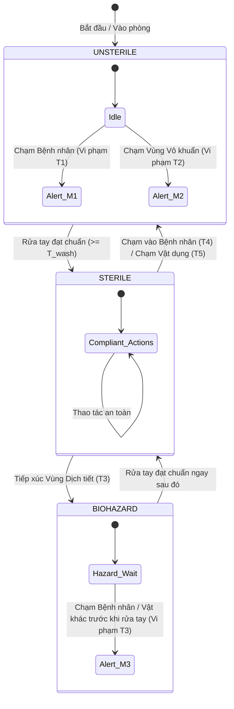

# KẾ HOẠCH TỔNG THỂ & ĐỀ XUẤT PHƯƠNG ÁN TỐI ƯU: HỆ THỐNG GIÁM SÁT TUÂN THỦ 5 THỜI ĐIỂM VỆ SINH TAY WHO TRONG ICU

---

## 1. RÀ SOÁT VÀ CHUẨN HÓA 5 THỜI ĐIỂM VÀNG RỬA TAY THEO WHO

Theo tiêu chuẩn quốc tế của Tổ chức Y tế Thế giới (WHO - *5 Moments for Hand Hygiene*), việc giám sát vệ sinh tay trong môi trường y tế (đặc biệt là phòng Hồi sức tích cực - ICU) dựa trên việc phân định 2 không gian chính:
- **Vùng bệnh nhân (Patient Zone):** Bao gồm người bệnh và các bề mặt, vật dụng dành riêng cho người bệnh (giường bệnh, thanh chắn giường, ga trải giường, đường truyền đang cắm vào người bệnh, monitor theo dõi gắn liền giường).
- **Vùng chăm sóc y tế (Health-care Area):** Toàn bộ môi trường bên ngoài vùng bệnh nhân (xe tiêm, bàn thao tác chung, máy móc dùng chung, cửa ra vào, bàn làm việc của điều dưỡng/bác sĩ).

```
   ┌───────────────────────────────────────────────────────────────────┐
   │ Health-care Area (Vùng chăm sóc y tế)                             │
   │   ┌────────────────────────────────────────────────────────────┐  │
   │   │ Patient Zone (Vùng bệnh nhân)                              │  │
   │   │  [Thiết bị/Vật dụng giường bệnh]                          │  │
   │   │       │                                                    │  │
   │   │  (5) Sau tiếp xúc vật dụng                                │  │
   │   │       │                                                    │  │
   │   │  (1) Trước khi chạm ──► [BỆNH NHÂN] ──► (4) Sau khi chạm   │  │
   │   │                              ▲                             │  │
   │   │               (2) Trước thủ  │  (3) Sau tiếp xúc           │  │
   │   │               thuật vô khuẩn │  nguy cơ dịch               │  │
   │   │                              │                             │  │
   │   │                    [Vùng thủ thuật / Dịch tiết]           │  │
   │   └────────────────────────────────────────────────────────────┘  │
   │                                                                   │
   │  [Vị trí bình rửa tay / Cồn sát khuẩn]                           │
   └───────────────────────────────────────────────────────────────────┘
```

### Chi tiết 5 thời điểm chuẩn WHO & Logic kích hoạt trong Hệ thống AI:

| STT | Tên thời điểm theo WHO | Định nghĩa lâm sàng chuẩn | Vùng & Sự kiện kích hoạt (Trigger Event) | Logic Trạng thái AI (State Requirement) |
| :--- | :--- | :--- | :--- | :--- |
| **1** | **Trước khi chạm vào bệnh nhân** (*Before touching a patient*) | Trước khi chạm vào bất kỳ bộ phận cơ thể hoặc quần áo của bệnh nhân khi bước vào vùng bệnh nhân. | Y tá/Bác sĩ di chuyển từ Health-care Area vào Patient Zone và phát hiện sự tiếp xúc (Contact) giữa tay nhân viên y tế và cơ thể bệnh nhân. | Trạng thái tay của nhân viên phải là `STERILE` (đã rửa tay trước đó và chưa chạm bề mặt bẩn). Nếu `UNSTERILE` $\rightarrow$ **Vi phạm Thời điểm 1**. |
| **2** | **Trước quy trình sạch / vô trùng** (*Before clean/aseptic procedure*) | Trước khi chạm vào vùng có nguy cơ nhiễm trùng (đặt catheter, tiêm truyền, hút đờm nội khí quản, thay băng vết thương, mở đường truyền). | Phát hiện tay nhân viên tiếp xúc với Vùng vô khuẩn định sẵn (Aseptic ROI: vị trí catheter, ống thở, khay vô khuẩn). | Bắt buộc trạng thái tay phải là `STERILE` ngay trước khi chạm vào vùng thủ thuật. Nếu vừa chạm vùng khác mà chưa sát khuẩn lại $\rightarrow$ **Vi phạm Thời điểm 2**. |
| **3** | **Sau khi tiếp xúc dịch cơ thể** (*After body fluid exposure risk*) | Ngay sau khi thực hiện thao tác có nguy cơ dính dịch cơ thể (hút đờm, xử lý bỉm/chất thải, tháo dây truyền dịch, thay băng gạc dính dịch). | Kết thúc thao tác tại vùng dịch tiết/thủ thuật, tay nhân viên rời khỏi vùng nguy cơ. | Trạng thái tay lập tức bị hạ xuống `BIOHAZARD/DIRTY`. Nhân viên phải thực hiện rửa tay trước khi chạm vào bất kỳ đối tượng nào khác. Nếu chạm vật khác mà chưa rửa $\rightarrow$ **Vi phạm Thời điểm 3**. |
| **4** | **Sau khi chạm vào bệnh nhân** (*After touching a patient*) | Sau khi kết thúc việc khám, chăm sóc, chạm vào bệnh nhân và rời khỏi bệnh nhân. | Tay nhân viên rời khỏi cơ thể bệnh nhân và bắt đầu di chuyển ra khỏi Patient Zone hoặc chuyển sang tác vụ khác. | Trạng thái tay chuyển thành `CONTAMINATED/UNSTERILE`. Bắt buộc phải rửa tay trước khi tiếp xúc bệnh nhân khác hoặc môi trường ngoài. |
| **5** | **Sau khi chạm vật dụng xung quanh** (*After touching patient surroundings*) | Sau khi chạm vào bất kỳ đồ vật, thiết bị trong vùng bệnh nhân (máy thở, bơm tiêm điện, thanh giường, bàn đầu giường) dù không chạm trực tiếp vào người bệnh. | Phát hiện sự tiếp xúc giữa tay nhân viên và các thiết bị/đồ vật trong Patient Zone, sau đó rời khỏi vùng. | Trạng thái tay chuyển thành `CONTAMINATED/UNSTERILE`. Bắt buộc phải rửa tay trước khi rời khỏi khu vực hoặc chạm vào vùng sạch. |

---

## 2. ĐÁNH GIÁ DEMO HIỆN TẠI & CÁC ĐIỂM CẦN TỐI ƯU

### Hạn chế của luồng Demo trong `demo.md`:
1. **Chưa phân biệt được các thiết bị và vùng vô khuẩn:** Demo mới chỉ phân chia 2 nhãn "Tự chạm tay" và "Chạm bệnh nhân", chưa có nhận diện vật dụng/thiết bị y tế (không thể giám sát được Thời điểm 2, 3 và 5).
2. **Khoảng cách pixel cố định (Fixed Pixel Distance):** Việc tính khoảng cách cổ tay bằng pixel cố định sẽ sai lệch nghiêm trọng khi nhân viên y tế đứng gần camera (tay to, khoảng cách pixel lớn) so với khi đứng xa camera (tay nhỏ, khoảng cách pixel nhỏ).
3. **Mô hình nhận diện rửa tay CNN 2D đơn giản:** Phân loại chuỗi khung hình bằng CNN 2D tĩnh dễ bị nhiễu bởi màu da, điều kiện ánh sáng, góc nghiêng hoặc hành động nắm tay thông thường.
4. **Theo dõi đối tượng (Tracking) đơn giản:** Chưa có cơ chế Re-ID (tái định danh) khi y tá bị che khuất (occlusion) bởi máy thở, rèm che hoặc đồng nghiệp khác.

---

## 3. ĐỀ XUẤT KIẾN TRÚC HỆ THỐNG TỔNG THỂ TỐI ƯU (END-TO-END PIPELINE)

```
                       [VIDEO STREAM TỪ CAMERA ICU]
                                    │
       ┌────────────────────────────┴────────────────────────────┐
       ▼                                                         ▼
[MODULE 1: SKELETON & TRACKING]                         [MODULE 2: SEMANTIC ICU SCENE]
- YOLOv11-Pose Multi-Person                             - Phân đoạn ngữ nghĩa thiết bị
- ByteTrack / BoT-SORT Re-ID                              (Máy thở, monitor, giường, bình cồn)
- Phân loại Role: Y tá (Dynamic) vs                      - Dynamic Patient Zone & Aseptic ROI
  Bệnh nhân (Static Bed)                                         │
       │                                                         │
       └────────────────────────────┬────────────────────────────┘
                                    │
                                    ▼
                 [MODULE 3: PROXIMITY & CONTACT GRAPH (HOI)]
                 - Chuẩn hóa khoảng cách theo tỉ lệ cơ thể (Scale-Aware)
                 - Phát hiện tương tác:
                   * Nurse-Hand ◄──► Nurse-Hand (Self-touching)
                   * Nurse-Hand ◄──► Patient-Body (Touching Patient)
                   * Nurse-Hand ◄──► Medical Equipment / Surroundings
                                    │
       ┌────────────────────────────┴────────────────────────────┐
       │ (Khi có Self-touching gần bình cồn/bồn rửa)              │ (Sự kiện tiếp xúc & rời đi)
       ▼                                                         ▼
[MODULE 4: NHẬN DIỆN RỬA TAY]                           [MODULE 5: FSM & WHO 5-MOMENTS ENGINE]
- Crop bàn tay độ phân giải cao                         - Finite State Machine (Sterile / Dirty)
- Spatial-Temporal Action Net (ST-GCN / VideoMAE / TSM) - Đối chiếu 5 Thời điểm vàng WHO
- Đếm thời lượng $\ge$ quy chuẩn (VD: $\ge 20s$ quy     - Cảnh báo vi phạm theo thời gian thực
  chuẩn hoặc $\ge 3-5s$ cồn nhanh)                      - Xuất báo cáo tuân thủ (Compliance Score)
```

---

## 4. PHÂN CÔNG CHI TIẾT THEO 2 HƯỚNG CHO BẢO & THÁI

> **Mục tiêu:** Nhận diện y tá, bệnh nhân tại ICU và các thiết bị xung quanh; xác định chính xác có sự tiếp xúc (contact) hay không.

### 4.1. Hướng 1: Skeleton Keypoint & Spatio-Temporal Interaction Graph (Phụ trách: BẢO)
*Phương pháp tiếp cận dựa trên khung xương (Pose-based) và Biểu đồ tương tác không-thời gian.*

- **Kiến trúc cốt lõi:**
  1. **Pose & Tracking:** Dùng `YOLO11x-pose` hoặc `RTMPose` kết hợp `BoT-SORT` (có trích xuất đặc trưng Re-ID để tránh mất dấu ID y tá khi bị che khuất).
  2. **Role Classification:** 
     - *Bệnh nhân:* Đối tượng nằm trong ROI Giường bệnh, độ biến thiên tọa độ trọng tâm cơ thể theo thời gian $\Delta Pos_{center} \approx 0$.
     - *Y tá / Bác sĩ:* Đối tượng có dáng đứng/ngồi di động, $\Delta Pos_{center} > \text{threshold}$.
  3. **Spatial Keypoint Proximity Graph:**
     - Xây dựng đồ thị liên kết các khớp: Cổ tay ($W_L, W_R$), Khuỷu tay ($E_L, E_R$), Vai ($S_L, S_R$), Hông, Đầu gối.
     - Tính ma trận khoảng cách Euclide chuẩn hóa giữa $Keypoints_{\text{Nurse}}$ và $Keypoints_{\text{Patient}}$.
  4. **Ưu điểm:**
     - Tốc độ xử lý cực nhanh (Real-time $\ge 30-45$ FPS), ít tốn tài nguyên GPU.
     - Không phụ thuộc vào màu sắc quần áo hay sự thay đổi chăn màn.
  5. **Hạn chế cần khắc phục:**
     - Khi y tá cúi người hoặc bị bệnh nhân che khuất một phần tay, keypoint có thể bị rung giật (jitter). Cần bổ sung bộ lọc Kalman Filter hoặc One-Euro Filter trên tọa độ keypoint.

### 4.2. Hướng 2: Semantic Scene Segmentation & 3D Bounding Box / HOI Contact State (Phụ trách: THÁI)
*Phương pháp tiếp cận dựa trên phân vùng ngữ nghĩa không gian và Mạng phát hiện tương tác Người - Vật (Human-Object Interaction - HOI).*

- **Kiến trúc cốt lõi:**
  1. **Scene Context Parsing (YOLO11-Seg / SAM-light):**
     - Tự động phân đoạn các vùng và thiết bị ICU: `Bed_ROI`, `Ventilator_ROI` (Máy thở), `InfusionPump_ROI` (Bơm tiêm điện), `Monitor_ROI`, `Catheter_ROI` (Vùng vô khuẩn/dẫn lưu), `Hand_Sanitizer_Dispenser_ROI` (Bình rửa tay cồn).
  2. **Hand Contact State Detection (Dựa trên ContactHands / Hand-Object Interaction Network):**
     - Phát hiện hộp bao bàn tay (Hand BBox) và dự đoán trạng thái: `No Contact`, `Self Contact`, `Person Contact`, `Object Contact`.
     - Xác định điểm tiếp xúc 2D/3D giữa Hand Mask và Object Mask (Intersection over Union - IoU > 0 hoặc Mask Overlap Gradient).
  3. **Ưu điểm:**
     - Nhận diện chi tiết được việc chạm vào thiết bị xung quanh và vùng thủ thuật vô khuẩn (đáp ứng trọn vẹn cả 5 thời điểm WHO, đặc biệt là Thời điểm 2, 3 và 5).
  4. **Hạn chế cần khắc phục:**
     - Tải tính toán nặng hơn nếu chạy full segmentation mỗi frame. Cần tối ưu: Chỉ chạy segmentation 1 lần để định vị thiết bị tĩnh (Static ROIs) hoặc cập nhật định kỳ (mỗi 1-2 giây), các frame còn lại chỉ track bounding box và hand mask.

### 4.3. Đánh giá & Chiến lược Kết hợp Tối ưu (Hybrid Ensemble)
- **So sánh 2 hướng:**
  - Hướng của **Bảo** cực mạnh và nhanh trong việc xác định tương tác **Người - Người** (Thời điểm 1 & 4).
  - Hướng của **Thái** giải quyết triệt để tương tác **Người - Thiết bị / Môi trường** (Thời điểm 2, 3 & 5).
- **Mô hình tích hợp:** Kết hợp **Bảo (Skeleton Fast Tracking)** làm khung nhận diện luồng chính, đồng thời gọi các module của **Thái (Spatial Device ROIs & Contact BBox)** khi y tá tiến vào các vùng quan tâm đặc biệt.

---

## 5. PHÂN CÔNG CHI TIẾT QUY TRÌNH CHO VINH

> **Mục tiêu:** Nhận diện hai bàn tay có tự chạm nhau hay không (Self-touching Detection) với cơ chế Chuẩn hóa theo tỉ lệ cơ thể (`Size tay ~ Size người`), làm điều kiện tiên quyết kích hoạt module nhận diện bước rửa tay.

```
                  [TỌA ĐỘ KEYPOINTS TỪ Y NHÂN VIÊN Y TẾ]
                                    │
                                    ▼
              [BƯỚC 1: TÍNH KÍCH THƯỚC CHUẨN HÓA CƠ THỂ L_norm]
              L_norm = Max( ||Vai Trái - Vai Phải||, ||Khuỷu tay - Cổ tay|| * 1.5 )
                                    │
                                    ▼
              [BƯỚC 2: TÍNH KHOẢNG CÁCH CHUẨN HÓA D_norm]
              D_norm = ||Cổ tay Trái - Cổ tay Phải|| / L_norm
                                    │
                      ┌─────────────┴─────────────┐
                      ▼                           ▼
            D_norm < Thresh_touch         D_norm >= Thresh_touch
             (Hai cổ tay lại gần)           (Hai tay cách xa)
                      │                           │
                      ▼                           ▼
      [BƯỚC 3: XÁC MINH VÙNG BÀN TAY]           [TRẠNG THÁI: KHÔNG RỬA TAY]
      - Hand Bounding Box Overlap IoU > 0
      - Duy trì liên tục >= T_trigger (0.5s)
                      │
                      ▼
      [BƯỚC 4: KÍCH HOẠT MÔ HÌNH NHẬN DIỆN RỬA TAY]
      - Spatial-Temporal Model (TSM / VideoMAE / ST-GCN)
      - Phân biệt: Rửa tay thật vs Bắt tay / Đan tay / Cầm vật
```

### 5.1. Thuật toán Chuẩn hóa theo Tỉ lệ Cơ thể (Scale-Aware Body Normalization)
Để khắc phục lỗi sai khoảng cách pixel khi đứng xa/gần camera:
1. **Trích xuất thước đo chuẩn cơ thể ($L_{\text{norm}}$):**
   $$L_{\text{norm}} = \|\mathbf{P}_{\text{Left\_Shoulder}} - \mathbf{P}_{\text{Right\_Shoulder}}\|_2$$
   *(Nếu bị che khuất vai, dự phòng bằng chiều dài cẳng tay: $L_{\text{norm}} = 1.6 \times \|\mathbf{P}_{\text{Elbow}} - \mathbf{P}_{\text{Wrist}}\|_2$ hoặc căn bậc hai diện tích Bounding Box: $\sqrt{Area_{\text{Person}} \times 0.1}$)*.
2. **Khoảng cách tương đối ($D_{\text{norm}}$):**
   $$D_{\text{norm}} = \frac{\|\mathbf{P}_{\text{Left\_Wrist}} - \mathbf{P}_{\text{Right\_Wrist}}\|_2}{L_{\text{norm}}}$$
3. **Điều kiện phát hiện Self-touching:**
   - Điều kiện 1 (Khoảng cách): $D_{\text{norm}} < \gamma$ (với $\gamma \approx 0.35 - 0.45$).
   - Điều kiện 2 (Chồng lấn Bounding Box bàn tay): $IoU(BBox_{\text{Hand\_L}}, BBox_{\text{Hand\_R}}) > 0.15$ hoặc khoảng cách tâm 2 BBox $< \text{Hand\_Size}$.
   - Điều kiện 3 (Thời gian duy trì): Trạng thái thỏa mãn liên tục $\ge 0.5$ giây (loại bỏ nhiễu khi 2 tay vô tình lướt qua nhau).

### 5.2. Nâng cấp Mô hình Nhận diện Rửa tay (Handwashing Action Recognition)
- Thay thế CNN 2D tĩnh bằng một trong hai hướng tối ưu:
  1. **Option A (Skeleton-based - Khuyên dùng cho Real-time):** Dùng `ST-GCN` (Spatial Temporal Graph Convolutional Network) hoặc `PoseC3D` trên 21 keypoints bàn tay (MediaPipe Hands / Hand Pose). Mô hình siêu nhẹ (~2-5MB), chống nhiễu màu da/ánh sáng tuyệt đối.
  2. **Option B (Video-based - Khuyên dùng cho độ chính xác cao):** Dùng `TSM` (Temporal Shift Module) trên backbone `MobileNetV3` hoặc `X3D-Tiny` phân tích clip 16 frames của vùng crop bàn tay.
- **Tiêu chuẩn hoàn thành chu trình rửa tay:**
  - Rửa tay bằng cồn (Alcohol rub): Duy trì động tác chà xát $\ge 15 - 20$ giây (hoặc cấu hình thử nghiệm $\ge 5 - 10$ giây trong bản demo).
  - Tự động phân loại: Đang chà xát (Washing) / Không chà xát (Idle/Touching).

---

## 6. THIẾT KẾ BỘ QUẢN LÝ TRẠNG THÁI (STATE MACHINE) & LUẬT PHÁT HIỆN VI PHẠM WHO



---

## 7. KẾ HOẠCH TRIỂN KHAI VÀ PHÂN CHIA NHIỆM VỤ

| Thành viên | Trách nhiệm chính | Deliverables cụ thể |
| :--- | :--- | :--- |
| **Bảo** | - Xây dựng Pipeline Multi-Person Pose Tracking (`YOLO11-pose` + `BoT-SORT`).<br>- Thuật toán phân loại Y tá / Bệnh nhân.<br>- Spatio-Temporal Interaction Graph xác định tiếp xúc Y tá - Bệnh nhân (T1, T4). | `tracking_engine.py`<br>`person_classifier.py`<br>`contact_graph.py` |
| **Thái** | - Xây dựng module Semantic Scene Parsing phân định các vùng `Patient Zone`, `Aseptic ROI`, thiết bị ICU.<br>- Module nhận diện tiếp xúc Thiết bị y tế & Dịch tiết (T2, T3, T5). | `scene_segmentation.py`<br>`device_roi_manager.py`<br>`equipment_contact.py` |
| **Vinh** | - Thuật toán phát hiện Self-touching với Scale-Aware Normalization ($L_{\text{norm}}$).<br>- Module Hand BBox Cropping & Hand Keypoint Tracking.<br>- Mô hình Phân loại Hành động Rửa tay (ST-GCN / TSM-MobileNet). | `self_touch_detector.py`<br>`scale_normalizer.py`<br>`handwash_classifier.py` |
| **Toàn đội** | - Tích hợp FSM Quản lý Trạng thái 5 Thời điểm WHO.<br>- Xây dựng giao diện trực quan hóa Demo (Visual Alert Overlay & Dashboard Báo cáo). | `who_5moments_fsm.py`<br>`main_pipeline.py`<br>`dashboard_ui.py` |
